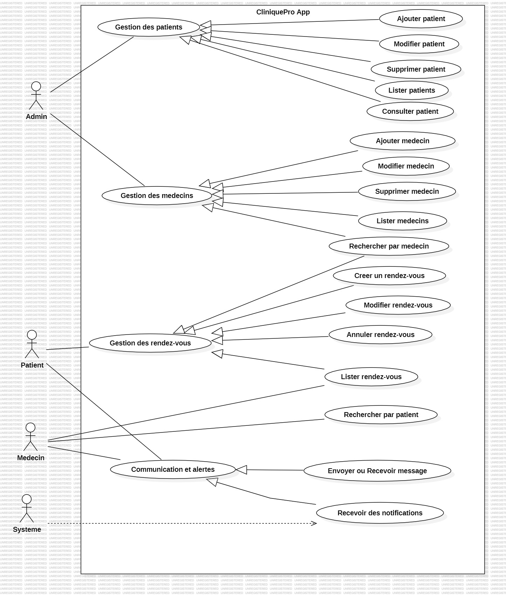

# CliniquePro

CliniquePro est une application backend de gestion clinique développée avec Java 17 et Spring Boot 3. Elle permet de gérer les patients, les médecins, les rendez-vous, les messages, les notifications et l’authentification sécurisée via JWT.

## 1. Objectif du projet

Le projet vise à centraliser la gestion d’une clinique en offrant une API REST capable de :

- gérer les comptes utilisateurs et les rôles,
- gérer les patients et les médecins,
- planifier, modifier et suivre les rendez-vous,
- échanger des messages associés aux rendez-vous,
- envoyer des notifications,
- sécuriser les accès avec Spring Security et JWT,
- déployer l’application avec Docker et MySQL.

## 2. Fonctionnalités principales

- Authentification JWT : inscription, connexion, déconnexion côté client
- Gestion des utilisateurs : admin, médecin, patient
- Gestion des patients : création, consultation, mise à jour, suppression
- Gestion des médecins : création, consultation, mise à jour, suppression
- Gestion des rendez-vous : création, consultation, modification, statut, suppression
- Messagerie interne liée aux rendez-vous
- Système de notifications
- Sécurité des endpoints par rôle
- Base de données MySQL avec Flyway
- WebSocket pour communication temps réel

## 3. Stack technique

- Java 17
- Spring Boot 3.3.0
- Spring Web
- Spring Data JPA
- Spring Security
- JWT (jjwt)
- MySQL
- Flyway
- Validation
- WebSocket
- Docker / Docker Compose
- Maven

## 4. Architecture du projet

Le code est structuré selon une architecture Spring classique :

- controllers : endpoints REST
- service : logique métier
- repository : accès aux données
- entity : modèles JPA
- dto : objets de transfert
- mapper : conversion entity/dto
- security : configuration JWT et sécurité
- enums : types d’énumération

### Structure générale

```text
src/
├── main/
│   ├── java/org/example/cliniquepro/
│   │   ├── config/
│   │   ├── controller/
│   │   ├── dto/
│   │   ├── entity/
│   │   ├── enums/
│   │   ├── mapper/
│   │   ├── repository/
│   │   ├── scheduler/
│   │   ├── security/
│   │   ├── service/
│   │   └── CliniqueProApplication.java
│   └── resources/
│       └── application.properties
└── test/
    └── java/org/example/cliniquepro/
```

## 5. Modèles de données

Le système met en œuvre les entités principales suivantes :

- User : utilisateur avec rôle, email et mot de passe
- Patient : informations du patient, relation avec User
- Medecin : informations du médecin, relation avec User
- RendezVous : date, statut, patient et médecin associés
- Message : messages liés à un rendez-vous
- Notification : alerte ou infos associées à un rendez-vous

## 6. Sécurité

La sécurité est configurée via Spring Security avec :

- protection des endpoints par rôle,
- authentification stateless,
- JWT dans les requêtes HTTP,
- CORS activé pour le front local (`http://localhost:5173`),
- routes publiques seulement pour l’authentification et les WebSockets.

Exemples de rôles :

- ADMIN
- MEDECIN
- PATIENT

## 7. Endpoints API principaux

### Authentification

- `POST /api/auth/login`
- `POST /api/auth/register`
- `POST /api/auth/logout`

### Patients

- `POST /api/patients`
- `GET /api/patients/{id}`
- `GET /api/patients`
- `PUT /api/patients/{id}`
- `DELETE /api/patients/{id}`

### Médecins

- `POST /api/medecins`
- `GET /api/medecins/{id}`
- `GET /api/medecins`
- `PUT /api/medecins/{id}`
- `DELETE /api/medecins/{id}`

### Rendez-vous

- `POST /api/rendezvous`
- `GET /api/rendezvous/{id}`
- `GET /api/rendezvous`
- `PUT /api/rendezvous/{id}`
- `PATCH /api/rendezvous/{id}/statut`
- `DELETE /api/rendezvous/{id}`

### Messages

- `POST /api/messages`
- `GET /api/messages/{id}`
- `GET /api/messages/rendez-vous/{rendezVousId}`
- `DELETE /api/messages/{id}`

### Notifications

- `POST /api/notifications`
- `GET /api/notifications/{id}`
- `GET /api/notifications/rendez-vous/{rendezVousId}`
- `DELETE /api/notifications/{id}`

## 8. Configuration et exécution

### Prérequis

- Java 17+
- Maven 3.9+
- MySQL 8+
- Docker + Docker Compose (optionnel)

### 1) Préparer la base de données

La base est configurée par défaut sur MySQL locale avec le schéma `clinique_pro`.

### 2) Démarrer l’application en local (backend Spring Boot)

Ce projet est un backend Java/Spring Boot, donc le lancement se fait avec Maven et non avec `npm run dev`.

```bash
./mvnw spring-boot:run
```

### 3) Démarrer avec Docker

```bash
docker-compose up --build
```

Le fichier `docker-compose.yaml` configure :

- un service MySQL,
- un service application Spring Boot,
- la communication réseau entre les deux services.

## 9. Variables d’environnement / configuration

Les paramètres sont définis dans `src/main/resources/application.properties`.

Points importants :

- `spring.datasource.url`
- `spring.datasource.username`
- `spring.datasource.password`
- `cliniq...app.jwtSecret`
- `cliniq...app.jwtExpirationMs`

Il est recommandé de stocker les informations sensibles dans des variables d’environnement ou un fichier local non versionné.

## 10. Tests

Le projet contient des tests unitaires sur les services principaux.

Pour lancer les tests :

```bash
mvn test
```

## 11. Diagrammes du projet

Les diagrammes disponibles dans le dossier `Diagrammes` sont les suivants :

### Diagramme de cas d’utilisation



### Diagramme de classe


### Diagramme d’ajout patient


## 12. Contexte métier

Le projet s’inscrit dans un contexte de gestion de consultation médicale. Il permet à une structure de santé de :

- organiser les rendez-vous entre patients et médecins,
- suivre les informations médicales concernant chacun,
- sécuriser les accès selon les rôles,
- communiquer rapidement entre les acteurs grâce aux notifications et au chat.

## 13. Remarques

- Le dépôt contient un serveur backend Spring Boot prêt à être consommé par un frontend.
- Les fichiers de configuration sensibles peuvent être adaptés selon l’environnement de déploiement.
- Cette documentation a été préparée pour fournir une vue d’ensemble claire du projet et de ses composants.

